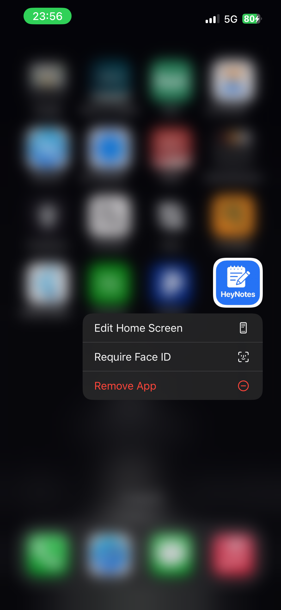
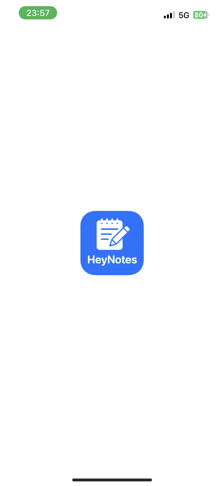
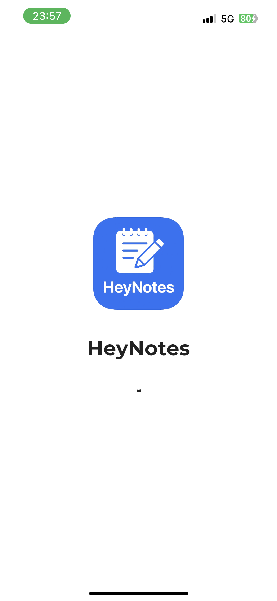
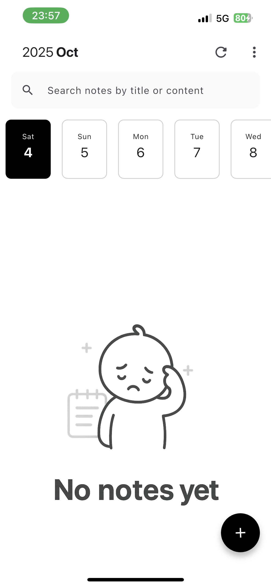
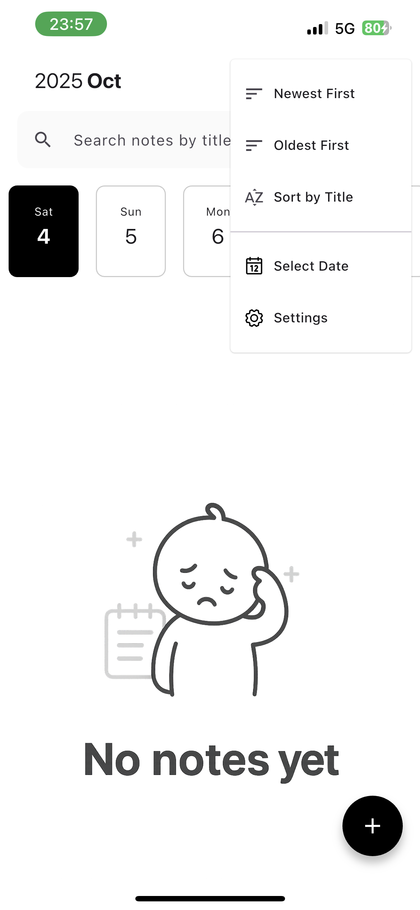
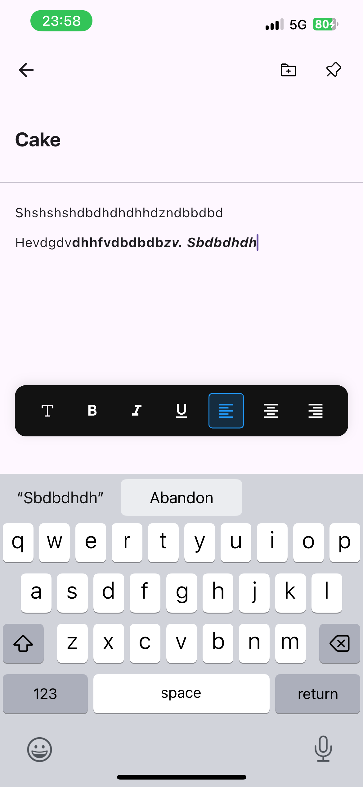
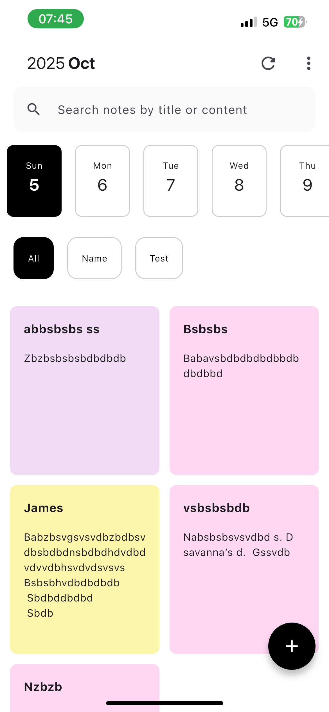
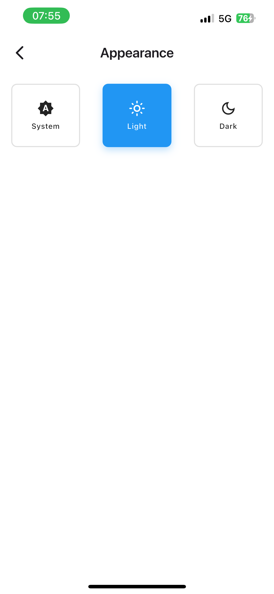
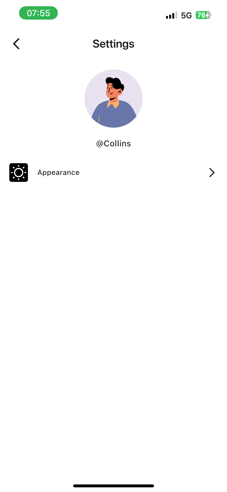

<div align="center">
  
  
  # Hey Notes

  A beautiful and intuitive note-taking app built with Flutter. Organize your thoughts, ideas, and tasks with rich text editing and powerful organization features.
  
  [](https://flutter.dev/)
  [](https://opensource.org/licenses/MIT)
  
  <div style="display: flex; flex-wrap: wrap; justify-content: center; gap: 10px; margin: 20px 0;">
    
    
    
  </div>
</div>

## ✨ Features

- 🎨 **Rich Text Editing** - Format your notes with bold, italic, underline, and more
- 📂 **Category Management** - Organize notes into custom categories
- 🔍 **Powerful Search** - Quickly find notes by title or content
- 🌓 **Theme Support** - Light and dark themes for comfortable viewing
- 📤 **Export & Share** - Export notes as PDF or share them directly
- 📍 **Pinning** - Pin important notes for quick access
- 🗂 **Tagging** - Add tags to organize and filter your notes
- 🔄 **Auto-save** - Never lose your work with automatic saving
- 📱 **Responsive Design** - Works on phones and tablets of all sizes
- 🔒 **Local Storage** - Your data stays on your device with Hive database

## 🚀 Getting Started

### Prerequisites

- Flutter SDK (latest stable version)
- Android Studio / Xcode (for running on emulator/device)
- VS Code or Android Studio (recommended for development)

### Installation

1. Clone the repository:
   ```bash
   git clone https://github.com/Collins-01/hey_notes.git
   cd hey_notes
   ```

2. Install dependencies:
   ```bash
   flutter pub get
   ```

3. Run the app:
   ```bash
   flutter run
   ```

## 🛠 Building the App

### For Development

```bash
flutter run
```

### For Release (APK)

1. Clean the project:
   ```bash
   flutter clean
   ```

2. Get dependencies:
   ```bash
   flutter pub get
   ```

3. Build the release APK:
   ```bash
   flutter build apk --release
   ```

4. The APK will be available at:
   ```
   build/app/outputs/flutter-apk/app-release.apk
   ```

### For Release (iOS)

1. Update the version in `pubspec.yaml`
2. Run:
   ```bash
   flutter build ios --release
   ```
3. Open Xcode and archive the app

## 📱 Screenshots

<div style="display: grid; grid-template-columns: repeat(auto-fit, minmax(200px, 1fr)); gap: 15px; margin: 20px 0;">
  
  
  
  
  
  
  
  
  
</div>

## 🛡️ Permissions

- **Android**:
  - `READ_EXTERNAL_STORAGE` - For saving exported files
  - `WRITE_EXTERNAL_STORAGE` - For saving exported files

- **iOS**:
  - `NSDocumentsFolderUsageDescription` - For file operations
  - `NSPhotoLibraryUsageDescription` - For saving files to photo library

## 🛠 Development Commands

This project includes a comprehensive Makefile with useful commands for development. Here are the available commands:

### Basic Commands
- `make get` - Install all dependencies
- `make clean` - Clean build files and cache
- `make build-runner` - Generate code using build_runner
- `make watch` - Watch for changes and regenerate code automatically
- `make doctor` - Check Flutter environment
- `make analyze` - Analyze code for issues
- `make format` - Format code using dart format

### Testing
- `make test` - Run all tests
- `make test-coverage` - Generate test coverage report

### Building
- `make build-apk` - Build release APK
- `make build-apk-debug` - Build debug APK
- `make build-apk-split` - Build release APK with split per ABI
- `make build-appbundle` - Build Android App Bundle (AAB)
- `make build-ios` - Build iOS app
- `make build-ipa` - Build iOS archive for App Store

### Development Workflows
- `make run` - Run app in debug mode
- `make run-release` - Run app in release mode
- `make pod-install` - Install iOS pods
- `make deps` - Check for outdated dependencies
- `make upgrade` - Upgrade all dependencies
- `make clean-build` - Clean, get deps, and run build_runner
- `make dev-build` - Complete development build pipeline
- `make release-apk` - Complete release APK build pipeline

## 🤝 Contributing

Contributions are welcome! Please feel free to submit a Pull Request.

## 📄 License

This project is licensed under the MIT License - see the [LICENSE](LICENSE) file for details.

